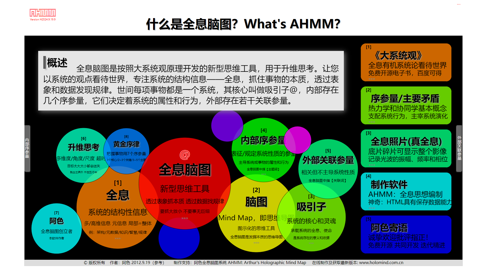
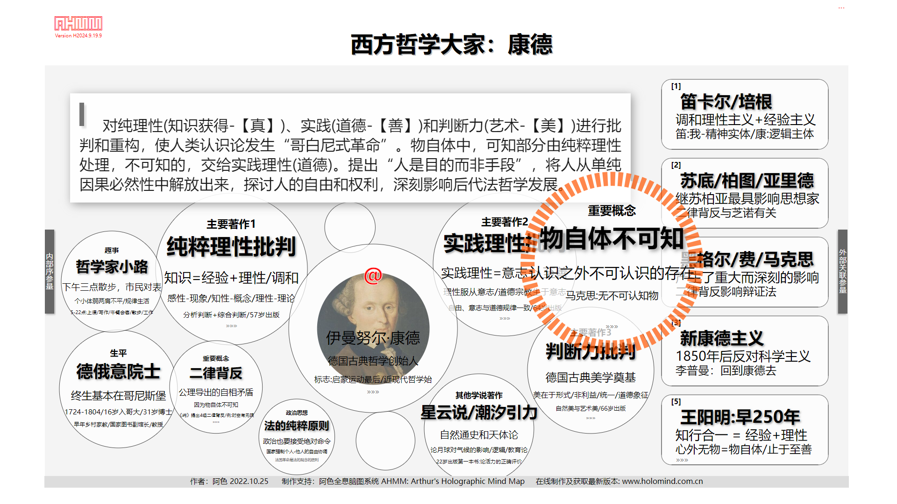
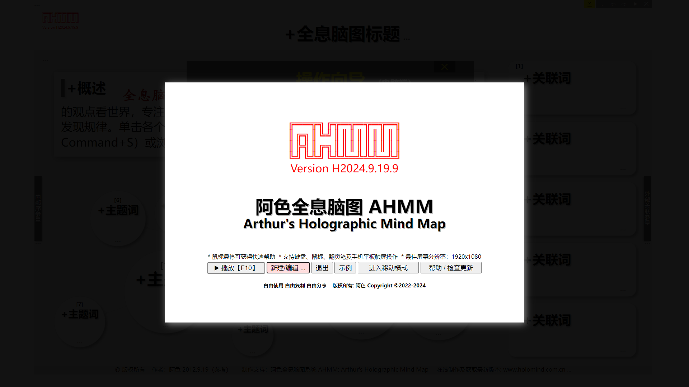
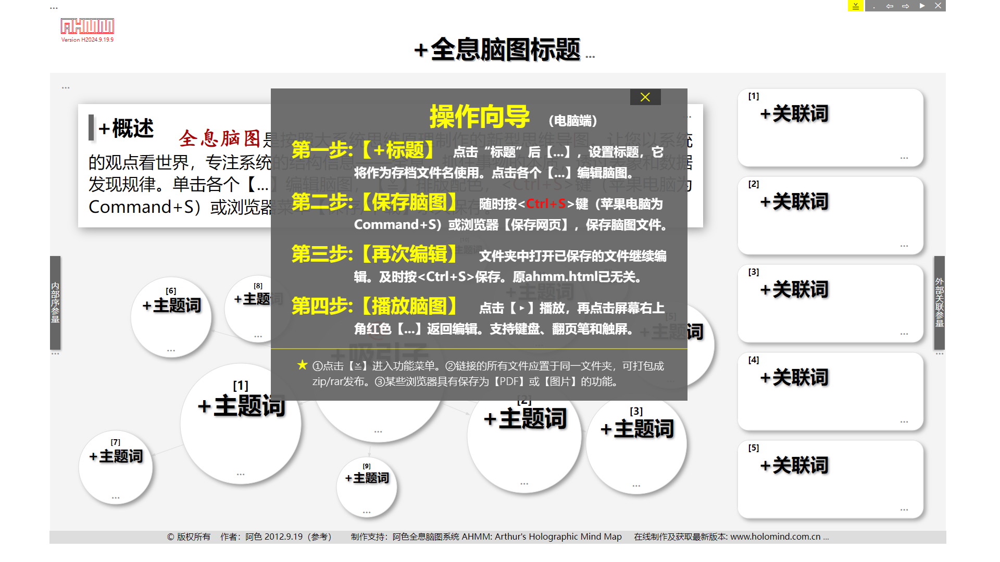
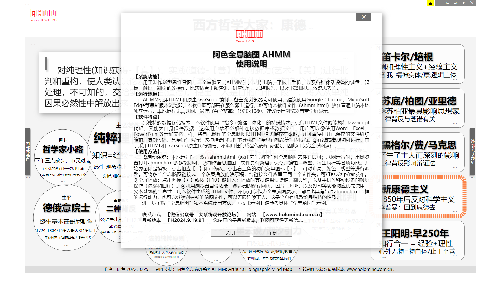

# AHMM ai+ / 阿色全息脑图：已升级至AI大模型一键自动生成

Try at / 使用：http://www.holomind.com.cn/ahmm/ahmm.html
  
【笔记】：2025.7.1 ：  
(1) 升级至AI版本。  
(2) 增加了使用deepseek后台自动生成全息脑图，采用sessionStorage+JSON传递数据。  
(3) 支持从网页或用户给定文本一键生成全息脑图。  
(4) 从网页生成时，通过浏览器扩展程序实现。扩展程序安装文件夹为AHMM_ai。  
(5) 服务器端程序位于ai文件夹内。

 
 

#### [中文🔃](#english)
# AHMM (Arthur's Holographic Mind Map)
## Current State

In 2022, invented a new kind of mind map called Arthur's Holographic Mind Map (AHMM) based on the principles of Big Systems View, and developed specialized software using JavaScript. It is still being continuously updated to this day.

AHMM is written in native JavaScript and does not use any frameworks.

## Summary
AHMM is used for system thinking with higher dimensions. Everything in the world is a system with a core, attractor @. AHMM observes the world from a systematic perspective, focusing on the structural information of the system, holography, and capturing the essence of things, then discovering patterns through appearances and data.

Software ahmm.html can be used online or downloaded for offline use. It has some magical characteristics of a holographic organic system: data and execution code are integrated, it can save data for itself, and can infinitely run and reproduce, that is, the generated AHMM can continue to generate the next generation.

## Software Features / Instructions for Use
### System Functions
Used to create a new type of mind map, Arthur's Holographic Mind Map (AHMM).
Supports keyboard, mouse, touch screen, laser flip pen and other operations on computers, tablets, mobile phones, and various mobile devices. Suitable for keynote speeches, lecture presentations, summary reports, as well as book summaries, systematic thinking, etc.
      
### Operating Environment
AHMM is developed using HTML and native JavaScript, and can be used by all popular browsers. 

It is recommended to use the latest versions of browsers such as Google Chrome and Microsoft Edge. This software can be deployed and run on a server, or the software file (ahmm.html) can be run independently on a regular computer. 

Local operation does not require networking. 

Best screen resolution: 1920x1080. Suggest using the browser's built-in full screen display.
      
### Software Features
① Unique data storage technology: This software uses a special technology of "instruction+data integration", which enables HTML files to execute JavaScript code and save data for themselves, so users do not have to connect to databases or data files separately. 

Users can save their created AHMM maps in HTML format locally, just like using regular documents such as Word, Excel, PowerPoint, etc., and can repeatedly open the saved files to continue editing, copying, spreading, and even derivative execution! 

This magical property is itself a characteristic of holographic organic systems.

② Can run online or offline: Due to the use of HTML and JavaScript native code, it does not call any finished code libraries or frameworks, so it can run completely offline.
      
### Usage
① To start the system: When running locally, double-click on ahmm.html (or any AHMM file generated from it); When running on the Internet, simply open the link to ahmm.html using a browser.

② To create AHMM maps: The software has various functions such as creation, saving, editing, adjustment, and derivative execution.

 The start page is the template, click on the ellipsis 【...】 to modify it. Click on the function menu icon 【≚】 in the upper right corner to adjust layout, color, line type, etc. 

Multiple AHMM maps can be linked into a multi page presentation, and each linked file should be placed in the same folder, which can be packaged into zip/ar for publication.

③ Full screen play: Click on the icon 【▶】 or press the 【F10】 key to enter; During play, it supports keyboard shortcuts, flip pens, and touch screen operations (edge and corner) on mobile devices such as smartphones.

④ To use the built-in features of the browser: the browser's functions of saving web pages, images, PDFs, and printing should be prioritized.

⑤ The holographic nature of this system: The HTML files generated by this software can not only be displayed as AHMM maps, but also have the same running ability as the original ahmm.html, and can continue to create new AHMM files, which can be infinitely continued. This is the most unique property of holographic organic systems.

To further understand the "Arthur's Holographic Mind Map" and the usage of this system, please refer to the specific example by pressing the [Example] key.

## Next Plan
① Process with Json.

② Develop English Version.

I hope to continue to receive everyone's support.

## Online Use / External Links
You can use it online on the 'Big Systems View' website and get more examples: 

http://www.holomind.com.cn/ahmm/ahmm.html

http://www.holomind.com.cn

  

#### [English🔃](#中文)
# 阿色全息脑图 AHMM
## 目前状态
2022年，应用大系统观思想原理，发明了一种新的思维导图——阿色全息脑图（AHMM, Arthur's Holographic Mind Map），并用 JavaScript 开发了专用软件，至今仍在持续更新。

AHMM 由原生 JavaScript 编写，不使用任何框架。

## 主要内容
AHMM 用于系统升维思考。世间每项事物都是一个系统，都有一个核心 —— 吸引子@。全息脑图以系统的观点看待世界，专注系统的结构信息——全息，抓住事物的本质，透过表象和数据发现规律。

阿色全息脑图制作软件 ahmm.html，可在线使用，也可下载后离线使用。它具有神奇的全息有机系统的特点：数据与执行码一体化，能自己给自己保存数据，并能够无限运行繁衍，即生成的脑图可以继续生成下一代脑图。

## 软件功能 / 使用说明
### 系统功能
用于制作新型思维导图——全息脑图（AHMM）。

支持电脑、平板、手机，以及各种移动设备的键盘、鼠标、触屏、翻页笔等操作。

比较适合主题演讲、讲座课件、总结报告，以及书籍概括、系统思考等。
      
### 运行环境
AHMM使用HTML和原生JavaScript编制，各主流浏览器均可使用，建议使用Google Chrome、MicroSoft Edge等最新版本浏览器。

本软件既可部署在服务器上运行，也可将本软件文件（ahmm.html）放在普通电脑本地独立运行。本地运行无需联网。

最佳屏幕分辨率：1920x1080。建议使用浏览器自带全屏显示。
      
### 软件特点
① 独特的数据存储技术：本软件使用“指令+数据一体化”的特殊技术，使得HTML文件既能执行JavaScript代码，又能为自身保存数据，这样用户就不必额外连接数据库或数据文件。

用户可以像使用Word、Excel、PowerPoint等普通文档一样，将自己制作的全息脑图以HTML格式保存在本地，并可重复打开已保存的文件继续编辑、复制传播，甚至衍生执行！

这种神奇的特性本身就是“全息有机系统”的特点。

② 在线或离线均可运行：由于采用HTML和JavaScript原生代码编写，不调用任何成品代码库或框架，因此可以完全脱网运行。
      
### 使用方法
① 启动系统：本地运行时，双击ahmm.html（或由它生成的任何全息脑图文件）即可；联网运行时，用浏览器打开ahmm.html的链接即可。

② 制作全息脑图：软件具有新建、保存、编辑、调整、衍生执行等各项功能。开始界面即是模板，点击相应【...】即可修改。点击右上角的功能菜单图标【≚】，可对布局、颜色、线型等进行调整。

可将多个全息脑图链接成一个多页播放的演示稿，各链接文件应置于同一个文件夹，可打包成zip/rar发布。

③ 全屏播放：点击图标【▸】或按【F10】键进入；播放时支持键盘快捷键、翻页笔，以及手机等移动设备的触屏操作（边缘和四角）。

④ 利用浏览器自带功能：浏览器的保存网页、图片、PDF，以及打印等功能均应优先使用。

⑤ 本系统的全息性：用本软件生成的HTML文件，不仅可以作为全息脑图展示，同时也具有与原ahmm.html一样的运行能力，也可以继续创建新的脑图文件，可以无限延续下去。

这是全息有机系统最独特的性质。

进一步了解“全息脑图”和本系统使用方法，可按【示例】键参考具体“全息脑图”示例。

## 下步计划
① 使用 JSON 接收数据。

② 开发英文版。

希望继续得到大家支持。

## 在线使用 / 外部链接
可在【大系统观】网站在线使用，并获得更多实例：

http://www.holomind.com.cn/ahmm/ahmm.html

http://www.holomind.com.cn

    

 
 
 

